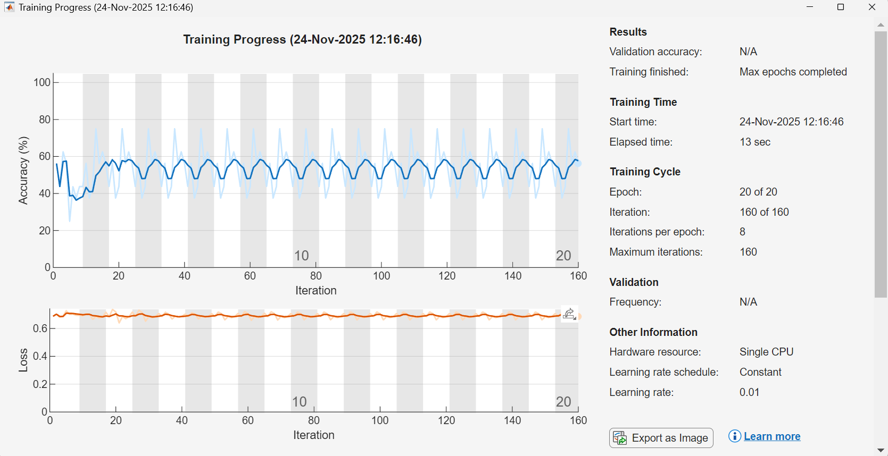
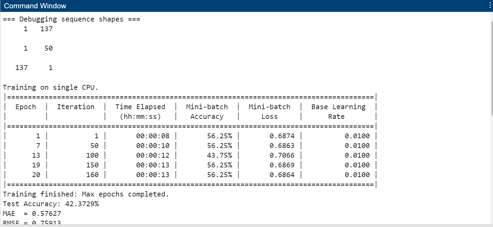

# 🚗 EV Battery Fault Detection Using SOC & LSTM

This project detects **faulty EV batteries** using
**State of Charge (SOC)** behavior and an **LSTM model**.

## 📂 Main File
- `EV_Fault_LSTM.m` – Complete MATLAB implementation

## 🧠 Key Concepts
- Coulomb Counting for SOC estimation
- Signal preprocessing
- LSTM-based fault classification

## 📊 Results

### Raw SOC

### Smoothed SOC

### Training Accuracy

## 🛠 Tools
- MATLAB
- Deep Learning (LSTM)

## 👨‍🎓 Author
**Suyash Naik**
